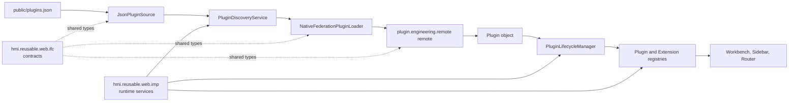
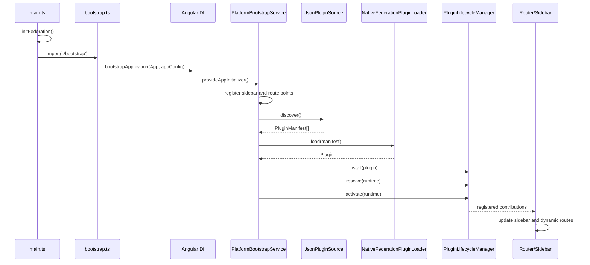

# Plugin Architecture

This document describes the plugin architecture currently implemented in the Angular proof of concept. It distinguishes working runtime behavior from extension points that are declared but not yet wired into the shell.

## 1. System Overview

The repository contains an Angular host application, a separately built Angular remote, and two reusable libraries:



At startup, `hmi.application.server` reads a catalog of plugin manifests, loads each remote through Native Federation, installs and resolves the resulting plugin, and activates its contributions. Activated contributions are stored centrally and consumed by shell UI services and components.

## 2. Repository Structure

The workspace is an Angular CLI monorepo. Its important projects are:

```text
projects/
  hmi.reusable.web.ifc/       Public plugin contracts and shared types
  hmi.reusable.web.imp/       Runtime implementation: discovery, lifecycle, registries
  hmi.plugin.engineering/     Engineering plugin library and contributions
  plugin.engineering.remote/         Native Federation remote exposing the engineering plugin
  hmi.application.server/     Host shell, startup, loaders, and workbench UI
```

The host serves static runtime metadata from `projects/hmi.application.server/public`. The remote is configured to serve on port `4300`; the host serves on port `4200`.

## 3. Package Responsibilities

### `hmi.reusable.web.ifc`

The interface package is the dependency boundary between the shell and plugins. It exports:

- `Plugin`, `PluginManifest`, `PluginDescriptor`, `PluginRuntime`, and `PluginState`
- `PluginLoader` and its `PLUGIN_LOADER` injection token
- Extension point and contribution types
- Known extension point IDs
- UI contribution types such as `MenuItem` and `ToolbarButton`
- Route, command, event, and logger contracts

This package should remain framework-light where possible. It defines what a plugin is and what it can contribute, but it does not discover, load, or activate plugins.

### `hmi.reusable.web.imp`

The implementation package provides the host-side runtime services:

- `PluginDiscoveryService`: coordinates source, loader, and lifecycle manager
- `PluginSource` and its `PLUGIN_SOURCE` injection token
- `PluginLifecycleManager`: installs, resolves, activates, stops, uninstalls, and restarts plugins
- `PluginRegistry`: stores plugin runtime metadata and state
- `ExtensionPointRegistry`: stores extension points registered by the shell
- `ExtensionRegistry`: stores contributions grouped by extension point
- `ServiceRegistry`, `PluginManager`, and other runtime services under active development

The host selects concrete source and loader implementations through Angular providers.

### `hmi.plugin.engineering`

This is the reusable engineering plugin library. It contains:

- `WelcomePlugin`, the plugin descriptor and contribution list
- `WelcomePageComponent`, a route target
- `WelcomeRouteContribution`, which contributes the `welcome` route
- `WelcomeSidebarContribution`, which contributes a sidebar item
- The library public API

The library does not know how the host discovers or loads it.

### `hmi.application.server`

This is the host shell. It owns:

- Angular bootstrap and application configuration
- Platform startup initialization
- Static JSON plugin discovery
- Native Federation plugin loading
- Host extension point registration
- Workbench, sidebar, and dynamic route integration

The host is the composition root: it chooses the concrete `PLUGIN_SOURCE` and `PLUGIN_LOADER` implementations.

### `plugin.engineering.remote`

This is the deployable Native Federation remote for the engineering plugin. Its `federation.config.mjs` exposes:

- `./Component`: the remote Angular application component
- `./Plugin`: `src/plugin.ts`, which re-exports `WelcomePlugin` as `Plugin`

The host loads `./Plugin`, not the remote application component, for the plugin runtime path.

## 4. Plugin Contracts

### `Plugin`

A plugin is currently modeled as:

```ts
interface Plugin {
  manifest: PluginManifest;
  contributions: ExtensionContribution<unknown>[];
}
```

The plugin manifest identifies the plugin and describes its remote loading information. Contributions are declarative objects associated with an extension point ID.

The engineering library currently uses a local plugin shape whose manifest contains only an `id`. The remote entry casts/re-exports that object as the public `Plugin` contract. This works as a prototype but should be unified with the IFC definition before stricter validation is introduced.

### `PluginManifest`

The catalog contract is:

```ts
interface PluginRemote {
  remoteEntry: string;
  exposedModule: string;
}

interface PluginManifest {
  id: string;
  plugin: PluginRemote;
}

interface PluginManifestInternal{
  id:string;
}

interface PluginCatalog {
  plugins: PluginManifest[];
}
```

`plugins.json` contains one or more `PluginManifest` records. The manifest is metadata used to locate and load a plugin; it is not the loaded plugin object.

### `PluginDescriptor`

`PluginDescriptor` is runtime metadata stored inside `PluginRuntime`. It contains the plugin manifest, lifecycle state, timestamps, dependencies, errors, startup duration, and source information.

The current source code also declares a separate local `PluginDescriptor` in `hmi.plugin.engineering`, containing only `id`. These two types have overlapping names but different responsibilities and should eventually be consolidated or renamed.

### `PluginLoader`

The loader contract is:

```ts
interface PluginLoader {
  load(manifest: PluginManifest): Promise<Plugin>;
}
```

The active implementation is `NativeFederationPluginLoader`. Older JavaScript and development loaders remain commented out as possible alternatives.

### `PluginSource`

The source contract is:

```ts
interface PluginSource {
  discover(): Promise<PluginManifest[]>;
}
```

`JsonPluginSource` is the active implementation. It requests `/plugins.json` through Angular `HttpClient` and returns the catalog's `plugins` array.

## 5. Plugin Discovery

`PluginDiscoveryService.discover()` performs the following sequence:

1. Calls the injected `PLUGIN_SOURCE`.
2. Receives an array of `PluginManifest` records.
3. Calls the injected `PLUGIN_LOADER` for each manifest.
4. Installs the loaded plugin through `PluginLifecycleManager`.
5. Resolves its contribution extension point IDs.
6. Activates the plugin when resolution succeeds.

The active provider configuration is in `hmi.application.server/src/app/app.config.ts`:

```ts
{
  provide: PLUGIN_SOURCE,
  useClass: JsonPluginSource
},
{
  provide: PLUGIN_LOADER,
  useClass: NativeFederationPluginLoader
}
```

Discovery currently processes manifests sequentially and does not catch an individual source, load, resolve, or activate failure. A single rejected operation can reject application initialization.

## 6. Native Federation Runtime Loading

The host uses `loadRemoteModule` from `@angular-architects/native-federation`:

```ts
const module = await loadRemoteModule({
  remoteEntry: manifest.plugin.remoteEntry,
  exposedModule: manifest.plugin.exposedModule
});

const plugin = module.Plugin as Plugin;
```

The catalog currently points to:

```json
{
  "remoteEntry": "http://localhost:4300/remoteEntry.json",
  "exposedModule": "./Plugin"
}
```

The remote's `federation.config.mjs` exposes `./Plugin`, and `src/plugin.ts` exports `WelcomePlugin` under the name `Plugin`.

The loader checks that the `Plugin` export exists, but it does not currently verify that the loaded plugin ID matches the manifest ID. The separate `federation.manifest.json` in the host public folder is not referenced by the shown `main.ts`, loader, or application configuration; the active runtime source is `plugins.json`.

Angular and supporting dependencies are configured as shared singleton dependencies in both federation configurations. This is intended to prevent duplicate Angular runtimes between host and remote.

## 7. Plugin Lifecycle

`PluginLifecycleManager` implements the current lifecycle:

### Install

Creates a `PluginRuntime` with state `INSTALLED`, initializes timing, dependency, error, and source metadata, then registers it in `PluginRegistry`.

### Resolve

Checks every contribution's `extensionPointId` against `ExtensionPointRegistry`. If an extension point is unknown, the plugin is marked `FAILED` and an error is recorded. Otherwise it becomes `RESOLVED`.

### Activate

Registers every contribution in `ExtensionRegistry`, sets the plugin state to `ACTIVE`, and records startup duration.

### Stop

Removes all contributions owned by the plugin and sets its state to `STOPPED`. Service cleanup is currently commented out.

### Uninstall

Removes the plugin from `PluginRegistry`. It currently does not call `stop`, so contributions may remain registered unless the caller stops the plugin first.

### Restart

Looks up a plugin and calls `activate` again. It currently does not stop or clear existing contributions first, so repeated restarts can duplicate contributions.

The lifecycle states are defined by `PluginState`; runtime metadata is updated immutably through Angular signals in `PluginRegistry`.

## 8. Extension Points

Extension point IDs are declared in `hmi.reusable.web.ifc`:

- `shell.sidebar`
- `shell.routes`
- `shell.toolbar`
- `shell.statusbar`
- `shell.dashboard`
- `shell.settings`
- `shell.property-sheet`

### Sidebar

The host registers `SIDEBAR_EXTENSION_POINT` during platform initialization. `Sidebar` reads `ExtensionRegistry.contributions<MenuItem>(ExtensionPoints.SIDEBAR)` and renders the resulting signal through its template. Engineering contributes a sidebar item through `WelcomeSidebarContribution`.

### Routes

The host registers `ROUTE_EXTENSION_POINT`. `RouterContributionService` observes route contributions with an Angular `effect`, maps them to Angular routes, and merges them into the router configuration with `resetConfig`. Engineering contributes the `welcome` route targeting `WelcomePageComponent`.

### Toolbar

`TOOLBAR_EXTENSION_POINT` exists and a host definition is present, but platform startup currently leaves its registration commented out. No toolbar rendering path is shown in the active shell.

### Other extension points

Status bar, dashboard, settings, and property sheet IDs are declared as future extension points. Their host registration, contribution payloads, and consumers are not yet implemented in the active path.

## 9. Startup Sequence



`initFederation()` completes before the host imports `bootstrap.ts`. Angular then runs the app initializer before the application is considered initialized.

## 10. Runtime Flow

For the current engineering plugin:

1. `GET /plugins.json` returns the `welcome` manifest.
2. Native Federation loads `http://localhost:4300/remoteEntry.json` and requests `./Plugin`.
3. The remote returns `WelcomePlugin` as `Plugin`.
4. The lifecycle manager installs it and checks `shell.sidebar` and `shell.routes` contributions.
5. The extension registry stores contributions with their owning plugin ID.
6. The sidebar signal exposes the contributed menu item.
7. The router effect observes the route contribution and appends the `welcome` route.
8. Navigating to `/welcome` renders the engineering welcome component in the workbench router outlet.

## 11. Current Implementation Decisions

- Angular standalone bootstrap is used through `bootstrapApplication`.
- Native Federation is the active remote loading mechanism.
- Plugin discovery and loading are selected through Angular injection tokens, allowing development or JavaScript implementations to be substituted later.
- Static JSON is the active plugin catalog source.
- Extension points are registered by the host before plugin discovery.
- Contributions are stored centrally and exposed reactively with Angular signals.
- Route contributions are merged into the existing router configuration rather than replacing the host routes.
- Shared Angular dependencies use singleton and strict-version federation settings.
- The engineering plugin is separated into a reusable library and a deployable federation remote.

## 12. Known Limitations / TODOs

- Add error handling and reporting around discovery, remote loading, and plugin activation.
- Validate that `plugin.manifest.id` matches `manifest.id` in `NativeFederationPluginLoader`.
- Unify the IFC `PluginManifest` model with the local engineering plugin manifest shape.
- Remove or rename the duplicate `PluginDescriptor` concepts.
- Make `Plugin` and `PluginManifest` public contracts consistent across the remote boundary.
- Make `uninstall` stop the plugin and remove its contributions before deleting registry metadata.
- Make `restart` stop and clear existing contributions before activating again.
- Prevent duplicate route entries when the route signal reruns or a plugin is restarted.
- Register and consume toolbar, status bar, dashboard, settings, and property sheet extension points.
- Implement service registration and cleanup; service registry integration is currently commented out.
- Resolve plugin dependencies; the runtime metadata has a dependency array, but resolution currently only validates extension point IDs.
- Add plugin version, vendor, description, compatibility, and integrity metadata if required by deployment.
- Decide whether `federation.manifest.json` should replace or complement `plugins.json`; it is currently unused in the shown runtime path.
- Add tests for discovery success/failure, loader contract validation, lifecycle transitions, contribution removal, and dynamic route updates.
- Consider an explicit activation policy and plugin isolation/security policy for remote code.

## 13. Important Configuration Files

| File | Responsibility |
| --- | --- |
| `package.json` | Angular, Native Federation, RxJS, TypeScript, and test dependencies; `start`, `build`, and `test` scripts |
| `angular.json` | Application/library projects, build targets, ports, assets, styles, and test builders |
| `tsconfig.json` | Workspace compiler options, project references, and local library path mappings |
| `projects/hmi.application.server/federation.config.mjs` | Host federation name, shared packages, and federation features |
| `projects/plugin.engineering.remote/federation.config.mjs` | Remote federation name, exposed modules, and shared packages |
| `projects/hmi.application.server/public/plugins.json` | Active plugin catalog consumed by `JsonPluginSource` |
| `projects/hmi.application.server/public/federation.manifest.json` | Additional federation manifest currently not referenced by the shown runtime code |
| `projects/hmi.application.server/src/app/app.config.ts` | Angular providers, router, app initializer, source, and loader selection |
| `projects/hmi.application.server/src/main.ts` | Native Federation initialization before Angular bootstrap |
| `projects/plugin.engineering.remote/src/plugin.ts` | Remote export that maps `WelcomePlugin` to the `Plugin` federation contract |

## 14. Development Workflow

### Install dependencies

The repository declares pnpm as its package manager:

```bash
pnpm install
```

### Build reusable libraries first

The TypeScript path mappings point at `dist`, so build the libraries before building consumers when the distribution output is absent or stale:

```bash
pnpm exec ng build hmi.reusable.web.ifc
pnpm exec ng build hmi.reusable.web.imp
pnpm exec ng build hmi.plugin.engineering
```

### Run the remote

Start the `plugin.engineering.remote` application on port `4300` so its `remoteEntry.json` is available:

```bash
pnpm exec ng serve plugin.engineering.remote
```

### Run the host

Start `hmi.application.server` on port `4200`:

```bash
pnpm exec ng serve hmi.application.server
```

The host then requests `/plugins.json`, and the catalog directs Native Federation to the remote at `http://localhost:4300/remoteEntry.json`.

### Validate changes

Use the workspace scripts or targeted Angular commands:

```bash
pnpm test
pnpm build
```

When changing a single project, prefer the targeted form:

```bash
pnpm exec ng test hmi.application.server
pnpm exec ng build hmi.application.server
```

When adding a plugin, the practical order is:

1. Define or extend the contract in `hmi.reusable.web.ifc`.
2. Add the runtime implementation or registry behavior in `hmi.reusable.web.imp` if needed.
3. Implement the plugin and its contributions in a reusable library.
4. Expose the plugin from a Native Federation remote under the expected export name.
5. Add a manifest entry to `projects/hmi.application.server/public/plugins.json`.
6. Register and render the corresponding extension point in the host.
7. Build libraries, start the remote, start the host, and verify discovery, activation, and UI contribution behavior.
